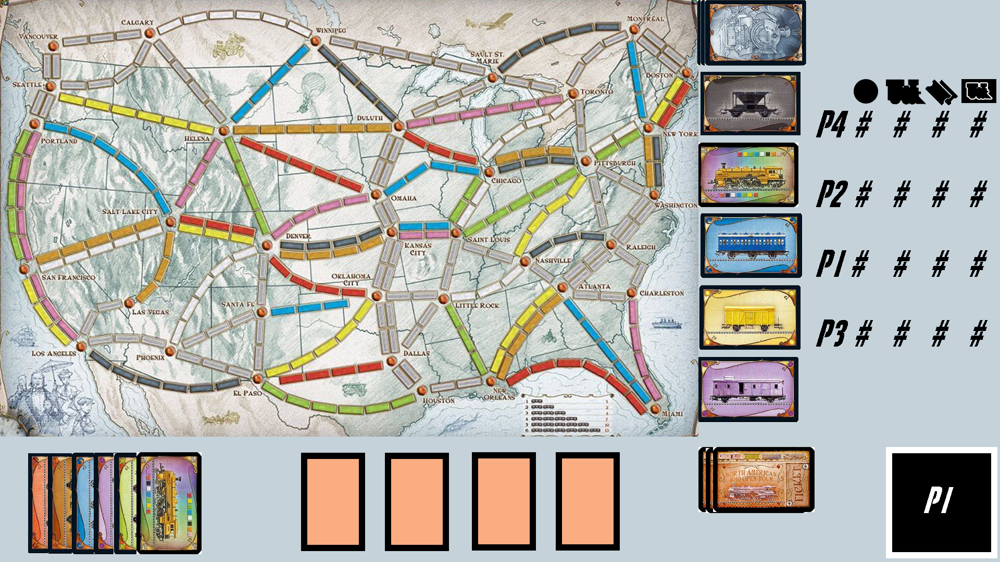

# Ticket to Ride

## Game Instructions
[Game Instructions](resources/instructions.pdf)

# Description
Our Java program attempts to digitally emulate the popular board game Ticket to Ride. In this repository, we will detail our process of care coordination to build this complex program. 

# User Interface

# Schedule

# Project status
Currently in planning phase of the project. 
